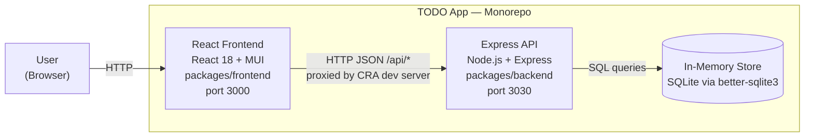
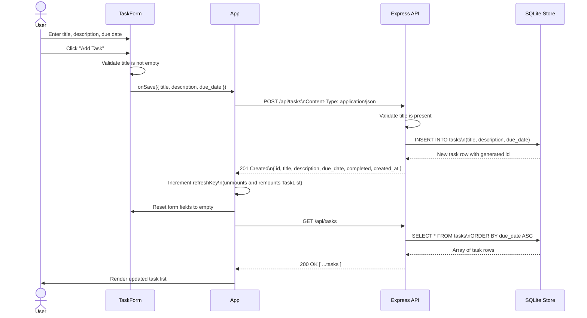

# Cloud Architecture Overview

## System Context

The TODO App is a monorepo containing a React single-page application and a Node.js/Express REST API that shares a single in-memory SQLite store. There is no external database, cloud service, or authentication layer — all state lives in process memory for the lifetime of the API server.

### Component Responsibilities

| Component | Technology | Role |
|-----------|-----------|------|
| **React Frontend** | React 18, MUI v7, CRA | Renders the task list and form; proxies API calls |
| **Express API** | Node.js, Express 4 | Validates input and executes CRUD operations |
| **In-Memory Store** | better-sqlite3 (`:memory:`) | Persists tasks for the lifetime of the API process |

---

## Sequence Diagram — Creating a TODO

The following sequence describes the full flow from the moment a user submits a new task through to the refreshed task list being displayed.

### Flow Summary

1. **Input** — The user fills in `TaskForm` and clicks submit.
2. **Client-side validation** — `TaskForm` rejects an empty title before any network call is made.
3. **API call** — `App.handleSave` sends `POST /api/tasks` with the task payload as JSON.
4. **Server-side validation** — The Express route returns HTTP 400 if `title` is missing or blank.
5. **Persistence** — The validated task is inserted into the in-memory SQLite table.
6. **Response** — The API returns the fully-formed task row (including generated `id` and `created_at`) with HTTP 201.
7. **List refresh** — `App` increments `refreshKey`, which remounts `TaskList` and triggers a `GET /api/tasks` to reload the full list.
8. **Render** — The browser displays the newly created task in the list.
